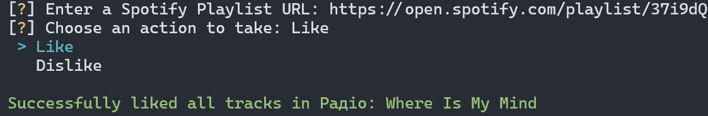

  

<h1 align="center">Гуртовий вподобайлик Spotify</h1>

### Зміст

- [Зміст](#зміст)
- [Інструкція зі встановлення](#інструкція-зі-встановлення)
- [Поради щодо використання](#поради-щодо-використання)
  - [Отримання даних для автентифікації](#отримання-даних-для-автентифікації)
  - [Підтвердження авторизації](#підтвердження-авторизації)
- [Скріншоти](#скріншоти)
- [Посилання](#посилання)
- [License](#license)

### Інструкція зі встановлення

- Завантажте [останню версію](https://github.com/seesmof/spotify-playlist-liker/releases) програми
  - Переконайтеся, що у вас встановлено Python 3.10 або новішої версії. Якщо ні, будь ласка, зробіть це - [остання версія](https://www.python.org/downloads/)
- Розархівуйте отриманий архів
- Відкрийте та запустіть файл `Run.bat`.
- Насолоджуйтесь!

### Поради щодо використання

#### Отримання даних для автентифікації

Щоб користуватися цим додатком, вам потрібно створити додаток Spotify в `Spotify для розробників`. Для цього, будь ласка, виконайте наведені нижче кроки, це зовсім не складно.

1. Перейдіть на сайт [Spotify для розробників](https://developer.spotify.com/dashboard/).
2. Увійдіть під своїм обліковим записом Spotify або зареєструйте новий, якщо у вас його немає.
3. Натисніть на кнопку "Створити додаток".
4. Заповніть необхідну інформацію для вашого додатку, включаючи назву та опис.
5. Після створення додатку вам буде надано `client ID` і `client secret`. Це унікальні ідентифікатори для вашого додатку.
6. Запам'ятайте `client ID` та `client secret`, оскільки вони знадобляться вам пізніше.
7. Встановіть `redirect URL` для вашого додатку. Це URL-адреса, на яку Spotify буде перенаправляти після того, як користувач надасть дозвіл на ваш додаток.
8. Після того, як ви виконали ці кроки, ви можете використовувати `client ID`, `client secret` і `redirect URL` у своєму коді.

#### Підтвердження авторизації

Під час користування додатком, після вибору плейлиста та дії, яку ви хочете виконати, у вашому браузері за замовчуванням може відкритися нова сторінка з запитом на авторизацію. Якщо це сталося, натисніть на кнопку "Дозволити". Після цього вас буде перенаправлено на сторінку, яка відповідає вказаній вами раніше "URL-адресі перенаправлення". Скопіюйте URL-адресу цієї сторінки і, коли з'явиться повідомлення `Enter the URL you were redirected to`, вставте її в консоль і натисніть Enter.

### Скріншоти

### Посилання

- [Іконка](https://www.flaticon.com/)

### License

Цей проект поширюється за ліцензією [MIT License](../LICENSE).

<a href="#readme-top"><strong>Повернутися до початку</strong></a>

